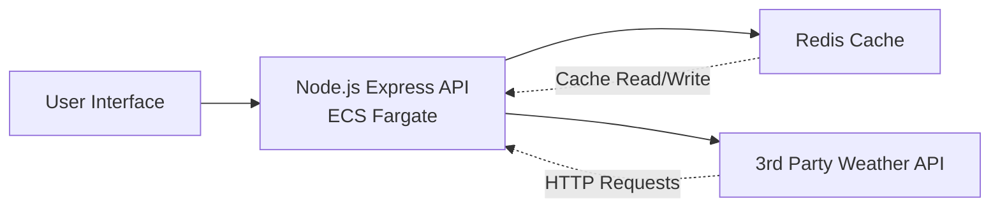
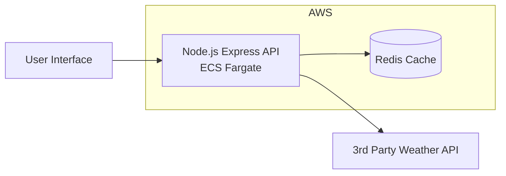
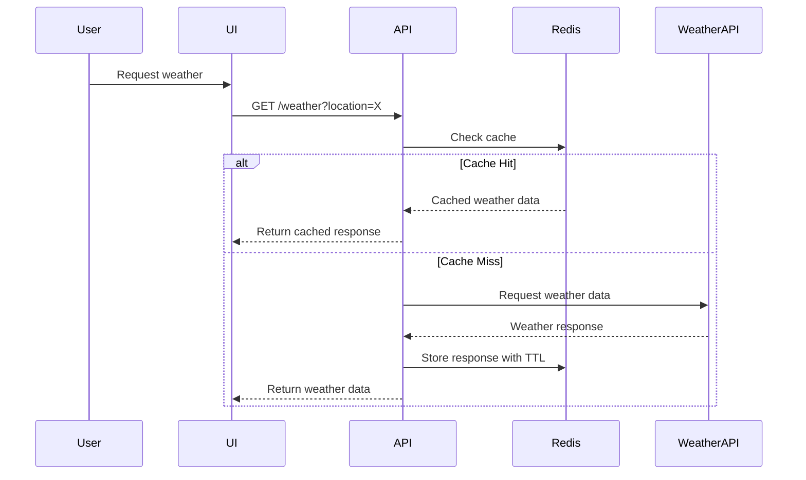

# Weather API Service -- System Design Overview

This document describes a simple architecture for a service that
retrieves weather data for a UI application.\
It is designed to be suitable for discussion in a **system design interview**,
covering architecture choices, trade‑offs, and operational considerations.

---

# Architecture Diagram

---

# AWS-Oriented Architecture

---

# Request Flow

---

# Component Breakdown

## 1. User Interface

The **UI** is the entry point for users.

Typical examples: - Web frontend (React / Vue / Angular) - Mobile
application - Internal dashboard

### Responsibilities

- Collect user input (location, preferences)
- Send requests to the backend API
- Render the returned weather data

### Why It Exists

Separates **presentation** from **business logic**.

This allows: - Independent frontend deployments - Multiple clients using
the same backend - API reuse by other services

---

# 2. API Layer (Node.js + Express)

The **Node.js Express API** acts as the central orchestrator of the
system.

### Responsibilities

- Handle HTTP requests
- Validate inputs
- Apply caching logic
- Call the weather provider API
- Format responses for the UI

### Why Node.js

Advantages include:

- Excellent for **I/O heavy workloads**
- Large ecosystem
- Good concurrency model
- Simple containerisation

### Why Express

Express provides:

- Lightweight routing
- Middleware support
- Easy API structure

---

# 3. ECS Fargate (Container Hosting)

The API runs inside **containers** hosted on **AWS ECS Fargate**.

### Why Fargate

Fargate removes the need to manage servers.

Benefits include:

- No infrastructure maintenance
- Automatic scaling
- Integrated AWS networking
- Security isolation

### Typical Architecture in Production

Often deployed behind:

- **Application Load Balancer (ALB)**
- **Auto scaling rules**
- **Multiple availability zones**

---

# 4. Redis Cache

Redis is used as a **high-speed caching layer**.

### Why Redis

Weather data typically:

- Changes periodically
- Is requested frequently
- Can tolerate short staleness

Caching improves:

- Response latency
- External API cost
- System resilience

### Example Cache Strategy

Key:

location:London

Value:

Weather response JSON

TTL:

5--15 minutes depending on use case

---

# 5. Third Party Weather API

An external provider supplies weather data.

Examples:

- OpenWeather
- WeatherAPI
- AccuWeather

### Responsibilities

- Provide authoritative weather information
- Handle complex meteorological calculations

### Design Considerations

External APIs introduce:

- Rate limits
- Latency
- Availability risk
- Cost per request

---

# Important Design Considerations

## Caching Strategy

Questions to discuss in interviews:

- What should the TTL be?
- What happens if cache expires during high traffic?
- Should we pre-warm the cache?

Possible strategies:

- Cache by location
- Cache aggregated responses
- Use stale‑while‑revalidate

---

# Scalability

### Horizontal Scaling

ECS Fargate tasks can scale horizontally.

Triggers may include:

- CPU usage
- Memory usage
- Request rate

---

# Failure Handling

Important failure scenarios:

### Weather API Down

Possible strategies:

- Return cached data
- Return degraded response
- Circuit breaker pattern

### Redis Failure

Possible strategies:

- Fall back to direct API calls
- Deploy Redis cluster
- Multi-AZ failover

---

# Observability

A real production system should include:

### Logging

Structured logs for:

- Request tracing
- API errors
- Cache misses

### Metrics

Key metrics:

- Cache hit rate
- API latency
- External API usage
- Error rates

### Monitoring Tools

Common tools include:

- CloudWatch
- Datadog
- Prometheus

---

# Security Considerations

Important security concerns:

- API authentication
- Rate limiting
- Secrets management
- HTTPS enforcement

Secrets such as weather API keys should be stored in:

- AWS Secrets Manager
- AWS Parameter Store

---

# Possible Enhancements

In a more advanced system design discussion you could add:

### CDN

A CDN could cache responses close to users.

### API Gateway

Provides:

- Authentication
- Rate limiting
- Request validation

### Message Queue

Useful for:

- Async weather updates
- Cache warming
- Event processing

Technologies could include:

- SQS
- Kafka

---

# Tradeoffs

Choice Benefit Tradeoff

---

Node + Express Fast development Single-threaded model
Redis cache Faster responses Cache invalidation complexity
External API No need for weather models Dependency risk
Fargate No server management Higher cost vs EC2

---

# Example Interview Talking Points

Good system design discussions might include:

- Cache hit rate targets
- API rate limiting strategies
- Cost optimisation
- Multi-region failover
- Latency optimisation

A strong candidate would explain:

- Why caching is necessary
- How to handle failures
- How the system scales under load

---

# Summary

This architecture provides:

- Simple scalable backend
- Reduced external API usage through caching
- Easy containerised deployment
- Clear separation of responsibilities

It is intentionally minimal but can be extended with:

- Load balancers
- Multi-region deployment
- More sophisticated caching
- Event-driven processing
